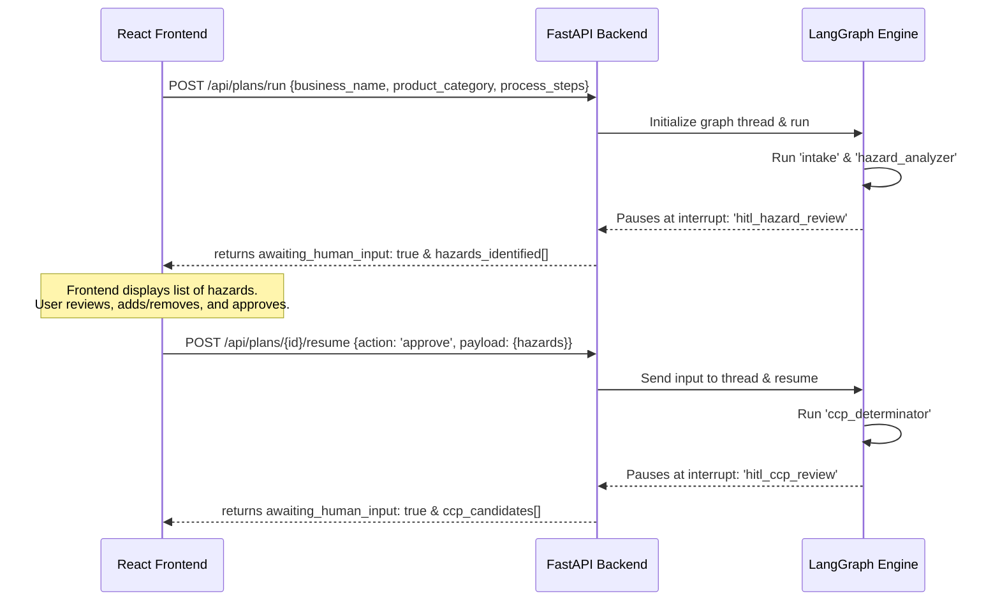

# HACCP AI System — React Frontend Specification & Integration Guide

> **Important for Lovable AI / React Developers:**  
> This application is built as a **Single Page Application (SPA)** using **Vite + React + Tailwind CSS**. The backend is an asynchronous FastAPI + LangGraph service. This document contains all the context, schemas, API endpoints, and flow logic required to build the frontend independently.

---

## 1. Project Context & Design Guidelines

### What is this System?
The **AI-Powered HACCP Documentation & Regulatory Compliance System** is a platform designed for food safety compliance under Indian regulatory frameworks (**FSSAI Schedule 4**) and **Codex Alimentarius** guidelines. It helps Food Business Operators (FBOs) create audit-ready Hazard Analysis Critical Control Point (HACCP) plans, review them through human-in-the-loop (HITL) interfaces, monitor critical control points (CCPs) in real-time, and get proactive compliance alerts when regulations change.

### Tech Stack
- **Framework**: Vite + React (TypeScript) + React Router DOM
- **Styling**: Tailwind CSS + shadcn/ui components (or custom Tailwind components)
- **Icons**: lucide-react
- **Charts**: Recharts (for CCP log history)
- **Deployment**: Wrangler / Cloudflare Pages

### Aesthetic & Theme (Food Safety / Premium Compliance)
- **Colors**: Cohesive HSL/Tailwind palette. Clean medical/laboratory whites, professional forest/emerald greens (`bg-emerald-50`, `text-emerald-700`, `border-emerald-200`) representing safety, with amber/red status accents for deviations and compliance alerts.
- **Micro-animations**: Smooth hover transitions, scale-in animations for cards, slide-in sidebar, and pulsing loaders when the AI agent is reasoning.
- **Responsiveness**: Collapsible dashboard sidebar, tables that scroll horizontally or stack as cards on mobile.

---

## 2. Shared Data Models (TypeScript Interfaces)

Use these exact interfaces in the React code to ensure compatibility with the FastAPI backend state schemas.

```typescript
export type HazardCategory = 'biological' | 'chemical' | 'physical';
export type SourceBody = 'FSSAI' | 'Codex' | 'FDA' | 'ICMR';
export type PlanStatus = 'draft' | 'in_progress' | 'complete' | 'under_review';

export interface HazardRecord {
  name: string;
  category: HazardCategory;
  process_step: string;
  source_in_process?: string;
  likelihood: number; // 1-5 scale
  severity: number;   // 1-5 scale
  rpn: number;        // Risk Priority Number (calculated: likelihood * severity)
  recommended_control: string;
  ai_confidence: number; // 0.0 - 1.0
  citations: string[];
  user_confirmed: boolean;
}

export interface CCPCandidate {
  hazard_name: string;
  process_step: string;
  is_ccp: boolean;
  confidence: number; // 0.0 - 1.0
  decision_tree_path: string[];
  reasoning: string;
}

export interface CCP {
  hazard_name: string;
  process_step: string;
  decision_tree_path: string[];
  user_override: boolean;
  override_justification?: string | null;
}

export interface CriticalLimit {
  parameter: string;
  min_value?: number | null;
  max_value?: number | null;
  unit: string;
  source_citation: string;
  user_validated: boolean;
}

export interface MonitoringProcedure {
  ccp_hazard: string;
  method: string;
  frequency: string;
  responsible_person: string;
  record_format: string;
}

export interface CorrectiveAction {
  ccp_hazard: string;
  trigger_condition: string;
  immediate_action: string;
  root_cause_procedure: string;
  personnel: string;
}

export interface VerificationSchedule {
  review_interval: string;
  audit_checklist: string[];
  sign_off_responsibility: string;
}

export interface HumanDecision {
  gate: 'hazard_review' | 'ccp_review' | 'limits_review';
  action: 'approve' | 'reject' | 'modify' | 'reanalyze';
  payload: Record<string, any>;
  justification?: string | null;
}

export interface HACCPState {
  plan_id: string;
  user_id: string;
  business_name: string;
  product_category: string;
  process_steps: string[];
  
  // P1 - P7 Stages
  hazards_identified: HazardRecord[];
  hazards_user_confirmed: boolean;
  ccp_candidates: CCPCandidate[];
  ccps_approved: CCP[];
  ccps_user_approved: boolean;
  critical_limits: Record<string, CriticalLimit>; // mapped by CCP name/id
  monitoring_procedures: MonitoringProcedure[];
  corrective_actions: CorrectiveAction[];
  verification_schedule: VerificationSchedule;
  records_generated: string[];
  
  // Control flow
  current_stage: 'intake' | 'hazard_analyzer' | 'ccp_determinator' | 'limit_fetcher' | 'monitoring_designer' | 'corrective_action_gen' | 'verification_planner' | 'record_generator' | 'plan_validator' | 'report_generator' | 'completed';
  awaiting_human_input: boolean;
  human_decision?: HumanDecision | null;
  rag_sources: string[];
}

export interface ComplianceAlert {
  id: string;
  regulatory_source: string;
  change_summary: string;
  affected_sections: string[];
  status: 'active' | 'resolved';
  created_at: string;
}
```

---

## 3. Asynchronous LangGraph Interaction Flow (HITL Protocol)

The plan generation is stateful and runs as a directed graph. The frontend must guide the user through this process asynchronously:



### The State Retrieval Rule:
Whenever a `POST` request to `/api/plans/run` or `/api/plans/{id}/resume` completes, it returns the updated `HACCPState`. 
1. If `awaiting_human_input` is `true`, freeze the stepper at the corresponding stage, render the matching interactive review card component, and wait for a `POST /api/plans/{id}/resume` submission.
2. If `awaiting_human_input` is `false`, show a loading animation with rotating compliance status checks while the background agent moves forward.

### Stage Name Mapping (Adaptor Pattern):
Because the backend uses LangGraph node interrupt states internally, it returns specific stage names in `current_stage`. The frontend client/adaptor should map these backend names to the frontend keys to keep the stepper highlights and review panels aligned:
- Backend: `"hazard_review"` ──> Map to Frontend: `"hazard_analyzer"`
- Backend: `"ccp_review"` ──> Map to Frontend: `"ccp_determinator"`
- Backend: `"limits_review"` ──> Map to Frontend: `"limit_fetcher"`
- Backend: `"completed"` ──> Map to Frontend: `"completed"`
- All other stages map 1:1.

---

## 4. API Endpoint Specifications

The frontend client should talk to `process.env.VITE_AGENT_API_URL` (default: `http://localhost:8000`).

### 4.1 System & Ingestion Check
* **GET `/health`**
  * Response: `{"status": "healthy", "version": "0.1.0", "services": {"api": "ok", "postgres": "ok (33 chunks)", "chromadb": "ok"}}`
* **POST `/api/ingest`**
  * Query Param: `clear_existing` (boolean, default: true)
  * Response: `{"status": "success", "documents_processed": 5, "chunks_created": 33, ...}`

### 4.2 Regulatory Chat (Phase 1)
* **POST `/api/chat`**
  * Request: `{"message": "string", "product_category": "string", "stream": false}`
  * Response: `{"answer": "Markdown text answering the query", "sources": ["FSSAI Schedule 4 Sec 1.1", ...], "confidence": "high" | "medium" | "low"}`
* **POST `/api/chat/stream`**
  * Request: `{"message": "string", "product_category": "string"}`
  * Response: SSE `text/event-stream` sending chunks of text, concluding with `data: [DONE]`.

### 4.3 Plan Creation & Steps (Phase 2)
* **POST `/api/plans/run`**
  * Request: `{"business_name": "string", "product_category": "string", "process_steps": ["step 1", "step 2", ...]}`
  * Response: Returns `HACCPState` containing `plan_id` and initial list of `hazards_identified` with `awaiting_human_input: true` and `current_stage: "hazard_analyzer"`.
* **POST `/api/plans/{id}/resume`**
  * Path Parameter: `id` (plan UUID)
  * Request: `HumanDecision` structure:
    ```json
    {
      "gate": "hazard_review",
      "action": "approve",
      "payload": {
        "hazards": [ ...confirmed hazards list... ]
      },
      "justification": "Checked against internal logs"
    }
    ```
  * Response: Returns updated `HACCPState`.
* **GET `/api/plans/{id}`**
  * Response: Returns current `HACCPState`.

### 4.4 Real-time Monitoring & Reports (Phase 3)
* **POST `/api/plans/{id}/monitoring`**
  * Request: `{"ccp_hazard": "string", "parameter": "string", "value": number, "unit": "string", "monitored_by": "string"}`
  * Response: `{"status": "recorded", "is_deviation": boolean, "corrective_action_required": "string | null"}`
* **GET `/api/plans/{id}/monitoring`**
  * Response: `{"logs": [{"ccp_hazard": "string", "parameter": "string", "value": 4.2, "timestamp": "2026-06-05T...", "is_deviation": false}]}`
* **POST `/api/plans/{id}/generate-pdf`**
  * Response: `{"job_id": "string", "status": "pending" | "completed"}`
* **GET `/api/plans/{id}/pdf`**
  * Response: Downloads the PDF file binary.

### 4.5 Compliance Alerts (Phase 3)
* **GET `/api/plans/{id}/alerts`**
  * Response: `{"alerts": [ComplianceAlert, ...], "compliance_score": 88}`

---

## 5. UI Page & Component Breakdowns

### 5.1 Route Mapping
Use React Router DOM to set up the following dashboard shell routes:
- `/` - Landing Page & Onboarding Flow
- `/login` / `/register` - Authentication forms (simple credential auth)
- `/dashboard/chat` - RAG-grounded chat console
- `/dashboard/plan-builder` - 7-step interactive wizard
- `/dashboard/monitor` - Real-time CCP logging and Charts
- `/dashboard/compliance` - Regulatory change log & score breakdown
- `/dashboard/reports` - Generated PDF download hub

---

### 5.2 Layout & Key Components

#### 1. Dashboard Layout (`/dashboard/*`)
* **Sidebar**: 
  - Collapsible design.
  - Links: Chat, Plan Builder, CCP Monitor, Reports, Compliance.
  - Organization Badge: Displays company name and FSSAI License Number (if set).
* **Top Bar**:
  - Breadcrumbs showing the current page.
  - Health indicator: Ping `/health` to show if database connections are active (green dot).
  - User profile dropdown with sign-out.

#### 2. Landing & Onboarding (`/` & `/register`)
* **Landing Page**: Modern web interface showcasing value proposition cards:
  - *Automated Hazard Trees*: AI builds hazard matrices tailored to your process.
  - *Codex-based CCPs*: Step-by-step decision tree checks.
  - *FSSAI Live Monitoring*: Web search agent tracks changes in Indian regulations.
* **Onboarding Form**: Setup organization name, FSSAI license input, and operations type selector (dairy, catering, ready-to-eat meals) to seed settings.

#### 3. RAG Chat Console (`/dashboard/chat`)
* Sidebar selector for food categories (e.g. *Dairy Pasteurized*, *Ready-to-eat*, *Catering*).
* Interactive query suggestions (e.g., "FSSAI critical limits for pasteurization", "Biological hazards in RTE meals").
* Chat list: Render streaming text clearly. Below each assistant response:
  - Display a **Confidence Indicator Badge** (High/Medium/Low) colored accordingly.
  - Render an accordion listing the **citations/sources** returned (with details: source body, document title, section).

#### 4. The 7-Step Plan Builder (`/dashboard/plan-builder`)
This is a dual-pane screen: Left is the active plan progress canvas, Right is the interactive AI review card.
* **A. Progress Stepper**: 
  - Horizontal list of the 7 HACCP principles.
  - Visual status: Completed (green check), In Progress (animated pulse), Blocked/Pending (grey).
* **B. Process Flow Builder (Step 1 - Intake)**:
  - List of process steps (e.g., receiving → storage → cooking → dispatch) with drag-and-drop sort order.
  - Users click "Generate Hazard Analysis" to trigger the `/api/plans/run` call.
* **C. Interactive HITL Cards (Right Pane)**:
  - **Hazard Review Card**: Appears when graph pauses. Displays a table of hazards, RPN values (Likelihood x Severity), and control actions. Let users toggle checkboxes to accept, edit a row in a modal, or click "Confirm Hazard Analysis".
  - **CCP Approval Card**: Visualizes the Codex decision tree path. Shows AI classification. Displays override text box: if user disagrees, they must type a justification, then hit "Approve CCP Configuration".
  - **Critical Limits Card**: List of CCP parameters with pre-filled FSSAI regulatory values. Allow custom numeric adjustments with warnings if they exceed default standard boundaries.

#### 5. CCP Monitoring Dashboard (`/dashboard/monitor`)
* **Status Panels**: Cards displaying active CCPs (e.g. "CCP-1: Milk Pasteurizer Temp"). Displays:
  - Current value & Acceptable target range (e.g., `> 72°C`).
  - Safe status badge (green check) vs. Deviation status (flashing red alert).
* **Record Entry Form**: Simple popup or card to input parameter log data.
* **Charts Panel**: A Recharts line chart showing parameter logs over time, with horizontal reference lines indicating the critical limits.
* **Deviation Event Log**: Alert box displaying corrective action triggers when a limit is breached, prompting for corrective action closure note.

#### 6. Compliance Dashboard (`/dashboard/compliance`)
* **Metrics Card**: A large gauge chart showing the **FSSAI Compliance Score (%)** derived from the compliance engine.
* **Section-by-Section Cards**: Accordions mapping to Schedule 4 parts, checking off elements (e.g. "Equipments calibrated: YES", "Water records: YES").
* **Proactive Regulation Feed**: A chronological list of alerts generated by the backend web-search agent. Each card displays:
  - Regulatory title (e.g., "FSSAI Microbiological Standards Amendment 2026").
  - Semantic diff alert: Flags in amber if a plan in the system is affected.
  - "Update Plan" action button.

#### 7. Reports Download (`/dashboard/reports`)
* List generated plans with timestamps and statuses.
* "Generate PDF" action which sets status to "generating" and pulls `/pdf-status` asynchronously until download link appears.
* JSON export link for interoperable schemas.

---

## 6. Integration Checklist & Step-by-Step UI Build Order

For a smooth implementation without API connectivity issues, build in this sequence:

1. **Scaffold & Routes**: Build the dashboard skeleton, Tailwind layout, and React Router navigation.
2. **API Mocking**: Configure a mock client or state so you can interact with all components even when the FastAPI agent is offline.
3. **Chat Module**: Hook up the Chat Page. Test proxying `/api/chat/stream` for SSE streaming.
4. **Intake & Stepper**: Build the process flow editor. Ensure it posts steps to `/api/plans/run`.
5. **HITL Review Gates**: Implement the Hazard Review table, the CCP decision tree card, and the resume endpoint callback.
6. **Charts & Logs**: Connect Recharts in the Monitoring dashboard. Trigger alerts on boundary crosses.
7. **Compliance Feed**: Design the alerts feed layout and gauge charts.
